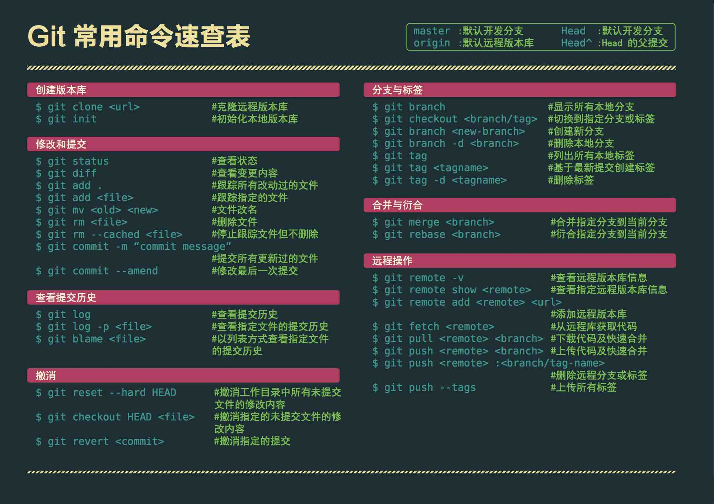
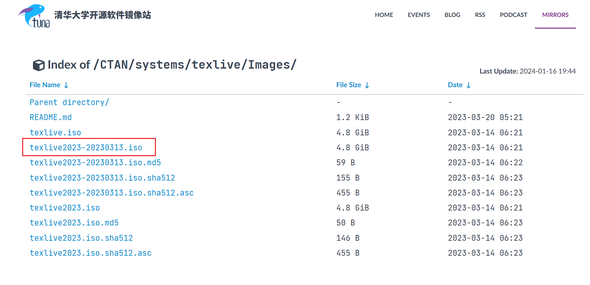
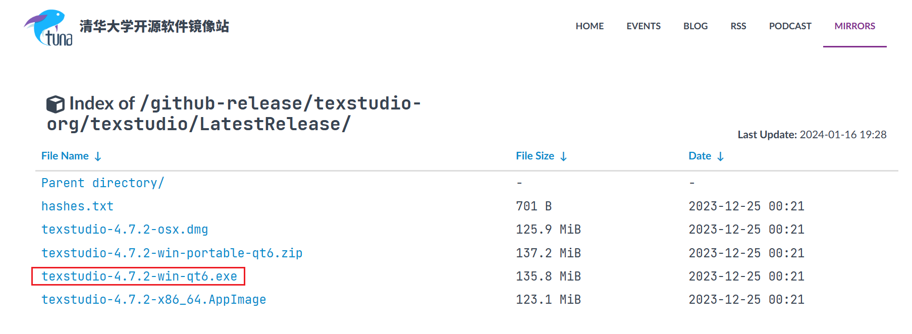

[toc]

## 环境搭建

### git
官网：[git](https://git-scm.com/)
安装教程：[Git 详细安装教程](https://blog.csdn.net/mukes/article/details/115693833)

在指定目录下打开命令行，输入以下指令，克隆仓库到本地：
```bash
git clone https://github.com/Silver-Ray/COMAP-2024
```

当需要从github上拉取并更新仓库时，使用以下指令：
```bash
git pull https://github.com/Silver-Ray/COMAP-2024
```



### markdown
建议直接用typora

Markdown语法指路：[Markdown 官方教程](https://markdown.com.cn/intro.html)

### Latex
本地环境：texlive+texstudio

#### texlive
  
[texlive清华源](https://mirrors.tuna.tsinghua.edu.cn/CTAN/systems/texlive/Images/)

使用清华源下载：


#### texstudio(编辑器)

[texstudio清华源](https://mirrors.tuna.tsinghua.edu.cn/github-release/texstudio-org/texstudio/LatestRelease/)



#### 参考资料
[LaTeX论文写作教程 (中文版)](https://github.com/xinychen/latex-cookbook/blob/main/README.md)

可以参考我的电设课的报告：[github electronic-experiment-course](https://github.com/Silver-Ray/electronic-experiment-course)
