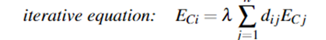

**表格妙妙工具**：[tablesgenerator](https://www.tablesgenerator.com/#)

- 空格：`\quad`

- 斜体：`\emph{your text} `  `\textit{your text}`

- 强调字体：`\textup{}  \textit{}  \textsl{}  \textsc{}`
  - 
  
- 字体加粗：`\textbf{}`
  - 
  
- 黑板粗体：`\mathbb{}`
  - 
  
- 行内公式：`$$`

- &, %前面要加转义符

- 无序列表（分点表达）
  - `$\bullet$`
  
  - 或者下面这种：
  
  - ```latex
    \begin{itemize}
    	\setlength{\parsep}{0ex} %段落间距
    	\setlength{\topsep}{2ex} %列表到上下文的垂直距离
    	\setlength{\itemsep}{1ex} %条目间距
    	\item ……
    	\item ……
    	\item ……
    \end{itemize}
    ```


- 图片引用 ：`Figure\eqref{fig: 图片label}`

- 插入单张图片

  - ```latex
    \vspace{-0.3cm}	 
    \begin{figure}[htbp]
    	\centering
    	\includegraphics[width=1\textwidth]{w.pdf}
    	\caption{图}\label{fig:w}
    \end{figure}
    \vspace{-0.8cm}
    \vspace{-0.3cm}	%与文章间隔 
    \begin{figure}[htbp]（图片编号为自动生成）
    	\centering
    	\includegraphics[width=0.8（调节大小）\textwidth]{work.pdf（文件名）}
    	\caption{图片注释}\label{fig:work(图片索引名)}
    \end{figure}
    \vspace{-0.8cm}	%与文章间隔
    ```


- 两张图片并排

  - ```latex
    \begin{figure}[htbp]
    	\centering
    	\begin{minipage}[t]{0.49\textwidth}
    		\centering
    		\includegraphics[width=0.9\textwidth]{pic1.pdf}
    		\caption{Pic1 }\label{fig:pic1 }
    	\end{minipage}
    	\begin{minipage}[t]{0.49\textwidth}
    		\centering
    		\includegraphics[width=0.9\textwidth]{pic2.pdf}
    		\caption{Pic2 }\label{fig:pic2}
    	\end{minipage}
    \end{figure}
    ```

- 表格索引：`\eqref{tab:  }`

- 插入三线表

  - ```latex
    \begin{table}[!htbp]
    	\caption{ }
    \label{  } 
    \centering
    	\begin{tabular}{cc}
    		\toprule[1.5pt] 
    		\makebox [0.25\textwidth][c]{parameter}	&  \makebox[0.45\textwidth][c]{description}\\
    		\toprule[1.25pt] 
    		$DII$ & dynamic influencer indicator\\
    		\bottomrule[1.5pt] 
    	\end{tabular}
    \end{table}
    \begin{table}[!htbp]
    	\caption{表格标题 }
    \label{表格索引名} 
    \centering
    	\begin{tabular}{cc}
    		\toprule[1.5pt]最上方的线
    		\makebox(设置列宽)[0.25\textwidth][c]{parameter}	&  \makebox[0.45\textwidth][c]{description}\\换行符
    		\toprule[1.25pt]一条直线
    		$DII$ & dynamic influencer indicator\\
    		\bottomrule[1.5pt]最下方的线条
    	\end{tabular}
    \end{table}
    ```

- 论文引用部分：`\bibitem{1}`

- 文内论文引用：`\cite{ }`

- 公式引用：`\eqref{eq:  }`

- 公式编辑

  - 基本格式：

  - ```latex
    \begin{shrinkeq}{-1.5ex}
    	\begin{equation}
    \label{eq:  }
    	
    	\end{equation}
    \end{shrinkeq}
    
    ```

  - 带花括号的公式：

  - ```latex
    \begin{shrinkeq}{-1.5ex}
    	\begin{equation}
    	d=\begin{cases}
    	1,\ \ \ \ \ \text{no directed edge  }from\ i\ to\ j	\\
    	0,\ \ \ \ \ \text{there is directed edge  } from\ i\ to\ j
    	\end{cases}
    	\end{equation}
    \end{shrinkeq}
    ```

  - 公式前加文字：

  - `\mbox{\emph{a:} \ \ \ }`

  - 

